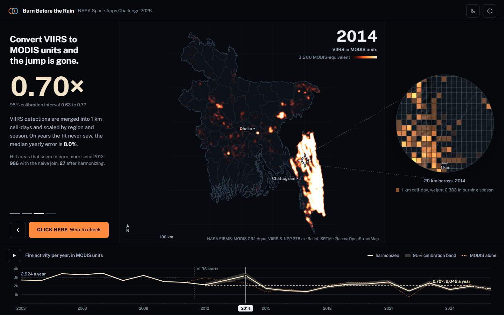
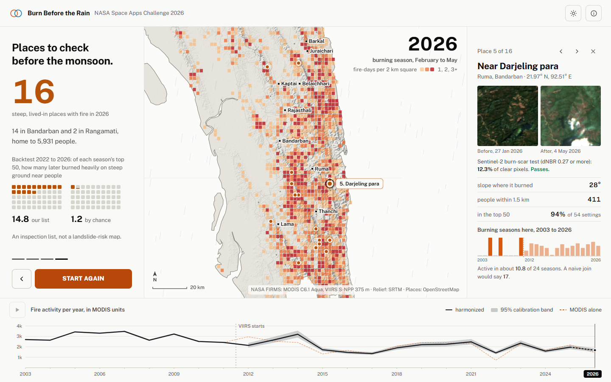
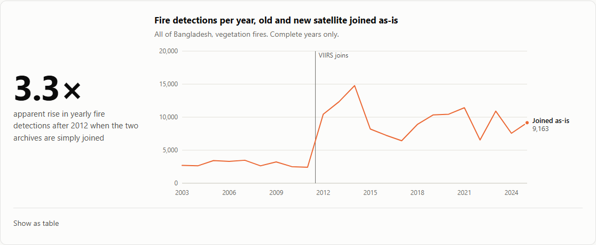
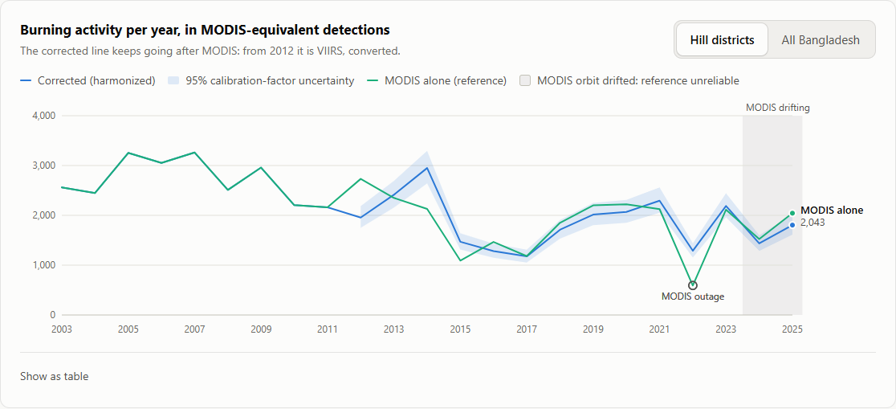
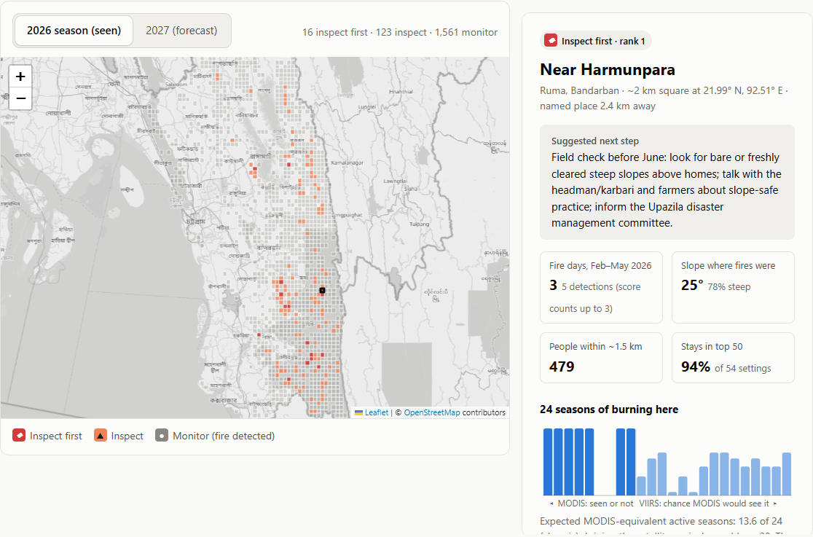
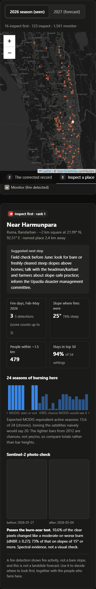
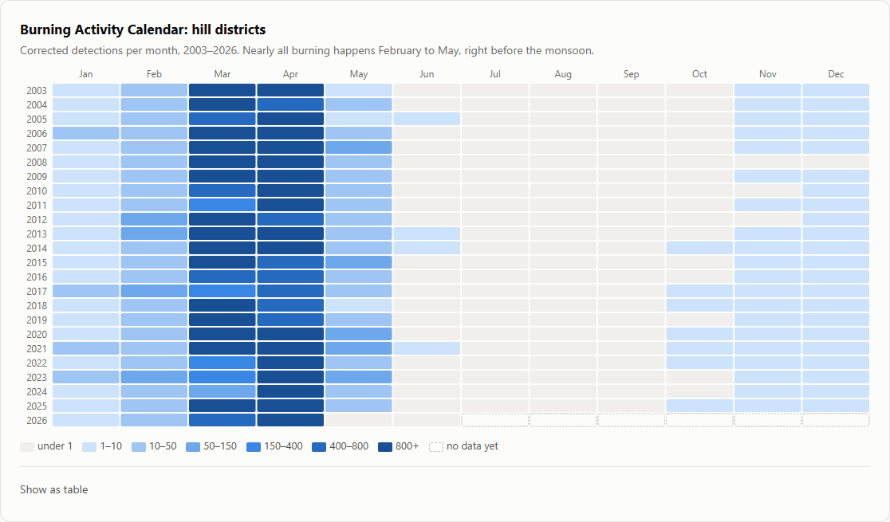

# Burn Before the Rain

A harmonized MODIS + VIIRS burning record for Bangladesh, and a pre-monsoon inspection list for the
Chittagong hill districts.

**NASA Space Apps Challenge 2026** · Challenge: *Harmonization of MODIS and VIIRS Hot Spots* · Team feb, Dhaka

## Interactive explainer

A one-page visual walk-through of the problem and the fix: two sensors, the false jump, the harmonized
record, and the 16 places to check. It is a single self-contained file, [showcase/index.html](showcase/index.html),
with light and dark modes, SRTM relief shading, OpenStreetMap towns and the Sentinel-2 before/after images
behind each place's burn-scar test. It needs no server; `netlify.toml` publishes the `showcase` folder.





## The problem

NASA has two long fire records. MODIS (since 2000) sees the ground in 1 km pixels. VIIRS (since 2012)
sees it in 375 m pixels, so it records one fire as several detections and catches small fires MODIS
misses. If the two archives are simply joined, fire activity in Bangladesh appears to **triple in 2012**.
That jump comes from the change of sensor, not from the fires.

This matters in the Chittagong hill districts. Hillsides there are burned for jhum farming from February
to May, just before the monsoon, and the same hills have deadly landslides. Anyone reading the raw record
would conclude that burning is getting much worse. It is not.

## What we built

1. **A harmonized Burning Activity Calendar, 2003–2026.** VIIRS is converted into MODIS-equivalent
   units, with a 95% calibration-factor uncertainty band, so the whole record can be read as one series.
2. **A 24-season burn history for every ~2 km area** in the five hill districts, built with the same
   harmonization.
3. **A pre-monsoon inspection list.** It ranks steep, populated places where fire was detected, so they
   can be checked before the rain. Each place carries its harmonized 24-season history; the ranking itself
   uses VIIRS fire-days, slope and population. The top places were tested against Sentinel-2 before/after
   imagery.
4. **A web app** that walks through the false jump, the corrected record, and any place on the map.

| The false jump | The corrected record |
|---|---|
|  |  |







## Key results

| Question | Result |
|---|---|
| How big is the false jump? | Naive join: **3.29×** more fire after 2012. Harmonized: **0.70×** (95% calibration-factor interval 0.63–0.77). |
| Does the conversion hold on unseen years? | Fitted on 2012–2019, tested on 2020–2023: **8.0% median annual error across regions** (hills and plains scored separately), +0.9% bias; hills in the burn season: 8.1%. The naive join is off by 609%, and a monthly climatology by 21.9%. For the Bangladesh-wide yearly total alone, one global ratio does slightly better (3.7% against our 6.2%); the regional factors are what get the hills/plains split right (a global ratio is off by 66–93% per region). |
| Is hill burning increasing? | Harmonized detected fire activity has **declined** since 2003 under this calibration (Kendall τ = −0.49, p = 0.0005). |
| What does the long record change per place? | 986 hill areas show an apparent increase since 2012 under the naive join, **27** after calibration. |
| Does the forecast inspection list find later burning on steep, populated ground? | In a 2022–2026 backtest, rebuilt each season from earlier data only, its top 50 held on average **14.8** cells that then burned heavily on steep ground with people nearby, against 8.8 for slope × people alone (no fire history), 4.4 for the burn forecast alone and about 1.2 by chance. Part of this gain is by construction, because the ranking already favours steep, populated cells; landslides are not tested. |
| Do the top places look burned in imagery? | On a Sentinel-2 before/after burn-scar test (dNBR), **15 of 20** top places pass, against 10 of 20 random fire cells and 2 of 20 cells with no fire detection. The difference between top places and random fire cells is not significant (p = 0.18), and at stricter thresholds random fire cells pass as often. This is spectral evidence consistent with burning; a blind visual check is prepared but not yet done. |
| How many places should be inspected first? | **16** for the 2026 season, mostly in Bandarban. They stay in the top 50 in at least 80% of 54 settings of our scoring grid. |

We also found two problems in the MODIS record itself, and excluded both from calibration:
- **Orbit drift.** MODIS Aqua's afternoon pass over Bangladesh moved from about 13:15 to 14:55 local
  time between 2023 and 2026.
- **An outage.** Aqua was in safe mode from 31 March to 17 April 2022. Those days are removed from both
  sensors before calibration.

Full results and checks: [docs/VALIDATION.md](docs/VALIDATION.md). Methods: [docs/METHODS.md](docs/METHODS.md).

## Run it

You need Python 3.11 or newer. The repository already contains the data and the pipeline outputs, so the
app runs straight away.

1. Install the packages:
   ```bash
   pip install -r requirements.txt
   ```
2. Start the app:
   ```bash
   python -m uvicorn backend.app:app --port 8765
   ```
3. Open http://localhost:8765/ for the app. The API documentation is at http://localhost:8765/docs.

To rebuild every result from the raw data (about 1–2 minutes; it downloads elevation tiles the first time):

```bash
python -m backend.run_pipeline
```

To run the tests:

```bash
python -m pytest backend/tests -q
```

Two optional steps need internet access:

- `python -m backend.run_pipeline --with-s2` fetches the Sentinel-2 imagery again (10–15 minutes).
- To download fire data newer than what is in `data/raw`, get a free MAP_KEY from
  [NASA FIRMS](https://firms.modaps.eosdis.nasa.gov/api/map_key/) and set it as the environment variable
  `FIRMS_MAP_KEY`, then re-run `python -m backend.run_pipeline`. For a new calendar year also raise
  `LAST_YEAR` in `backend/config.py`.

## How it works

1. **Footprint.** VIIRS detections are reduced to unique ~1 km cell-days, about the size of a MODIS pixel.
2. **Scaling.** For each region and season we learn how many MODIS detections correspond to one VIIRS
   cell-day, using only the years when both sensors flew and MODIS Aqua was reliable (2012–2023).
3. **Uncertainty.** The calibration years are resampled 2,000 times to give a 95% interval.
4. **Per-area history.** For each ~2 km area, a calibration curve gives the chance that MODIS would
   have seen fire, given what VIIRS saw. This makes the seasons before and after 2012 comparable.
5. **Inspection list.** Each area is scored as fire × steepness × people, with slope and population
   measured at the fire points themselves. Places that stay in the top 50 in at least 80% of 54 settings
   of our scoring grid are marked "inspect first".
6. **Forecast.** For next season we compared four methods with a rolling-origin test, refitting everything
   each season on earlier seasons only. The simple history rule performed best in this comparison on precision
   and average precision (the ML model was close, with a slightly higher ROC AUC), so it is the default.

## Repository layout

```
backend/
  app.py              API and static file server
  config.py           settings (years, grid sizes, thresholds)
  run_pipeline.py     runs every step in order
  pipeline/           download, prepare, harmonize, terrain, history, model, watchlist, s2check
  tests/              29 tests
frontend/             the web app (HTML, CSS, JavaScript, Leaflet)
data/
  raw/                NASA FIRMS fire detections for Bangladesh
  ref/                boundaries, population, place names
  processed/          pipeline outputs used by the app
docs/                 methods, results and validation, screenshots
tools/                blind_review/ (coded Sentinel-2 image pairs for a blind visual check) and
                      capture_screenshots.py (layout checks for the web app; needs `pip install playwright`)
```

## Data and credits

- **Fire detections:** NASA FIRMS, MODIS active fire (MCD14ML; Collection 6 files up to 2022, 6.1 from
  2023) and VIIRS S-NPP 375 m active fire (VNP14IMGTML).
- **Imagery:** Copernicus Sentinel-2 L2A, accessed through Earth Search (Element 84).
- **Population:** WorldPop 2020.
- **Boundaries:** geoBoundaries.
- **Place names and base map:** © OpenStreetMap contributors.
- **Elevation:** AWS Terrain Tiles (SRTM-based).
- **Map library:** Leaflet.

Sources and licenses for the data files are listed in [data/README.md](data/README.md).

## Limitations

- **This is not a landslide-risk map.** No landslide records were used. A burned steep slope is a warning
  sign that deserves a look, not a prediction.
- Fire satellites cannot see hill-cutting for housing, which is behind many landslide deaths in
  Chittagong and Cox's Bazar.
- MODIS is our reference, not the truth. Both sensors miss small fires and fires under cloud.
- The scoring scales are our own choices. The ranking is sensitive to them, which is why only 16 places
  are marked "inspect first"; that marks stability within our settings, not a probability of being right.
- The uncertainty band covers the conversion factors only, not missed fires or other error sources.
- Jhum is a traditional livelihood. The list is meant for safety checks and support together with hill
  communities, and it has not yet been reviewed by people who work there.

More detail is in [docs/VALIDATION.md](docs/VALIDATION.md#8-limitations).

## License

Code: MIT, see [LICENSE](LICENSE). Data: see [data/README.md](data/README.md).
